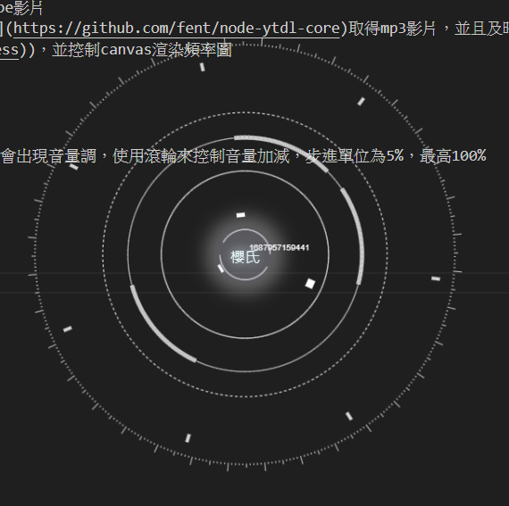
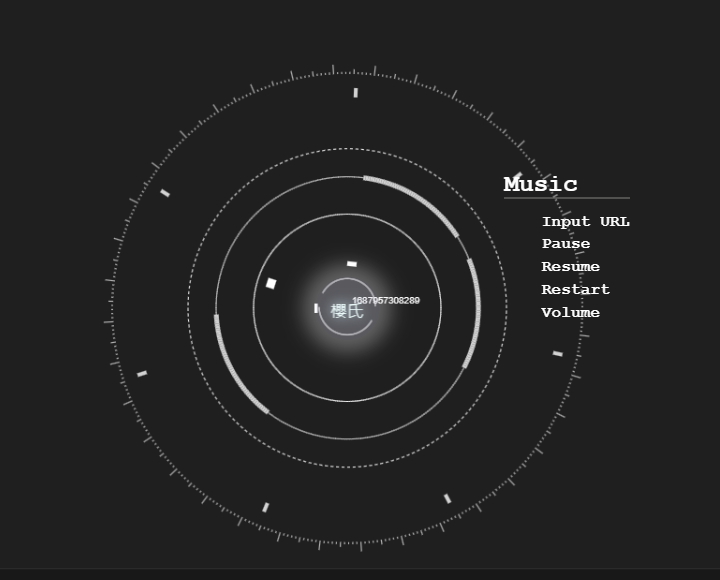
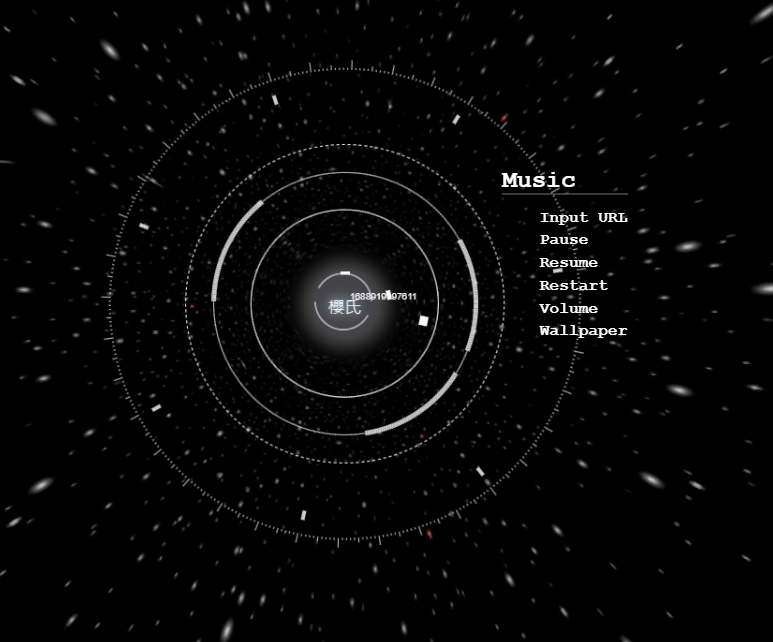

# Assistant
使用electron.js打造的桌面助理 
 
 
 
## 選單
### music

- Input URL  
    播放輸入的youtube影片(目前不支援歌單) 
    在後端使用[ytdl](https://github.com/fent/node-ytdl-core)取得mp3影片，並且及時串流回前端(使用[express](https://github.com/ expressjs/express)、[ffmepg](https://ffmpeg.org/))，並控制canvas渲染頻率圖
- Pause
- Resume
- Restart
- Volume 
  觸發之後，畫面中心會出現音量調，使用滾輪來控制音量加減，步進單位為5%，最高100%
  

## 預計會有的設定
### music
- 格式(mp3/mp4)
- 品質

## 已知問題
有時會在隨機時間後結束播放 
https://stackoverflow.com/questions/67888365/error-output-stream-closed-when-trying-to-stream-to-express-server-using-ffmpeg