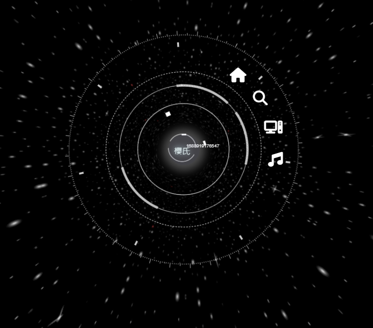
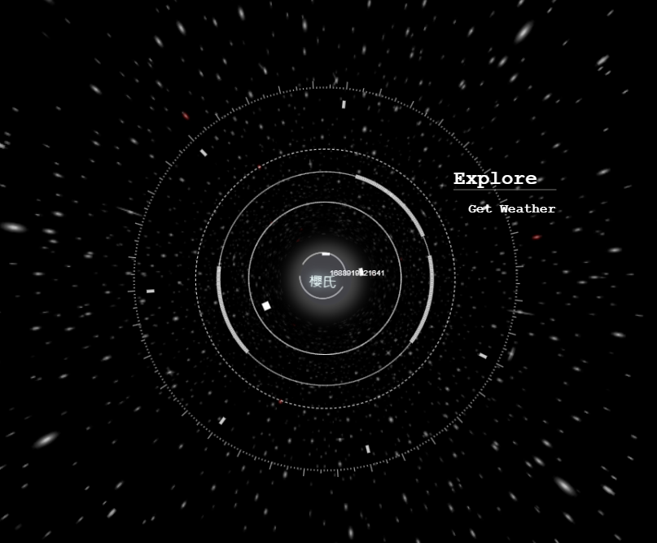
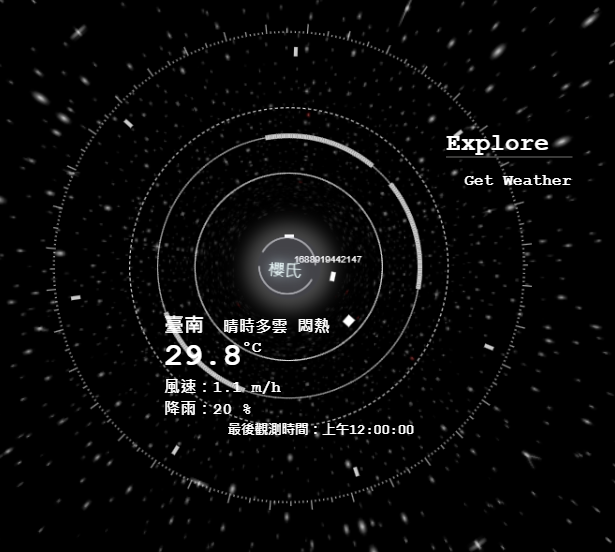
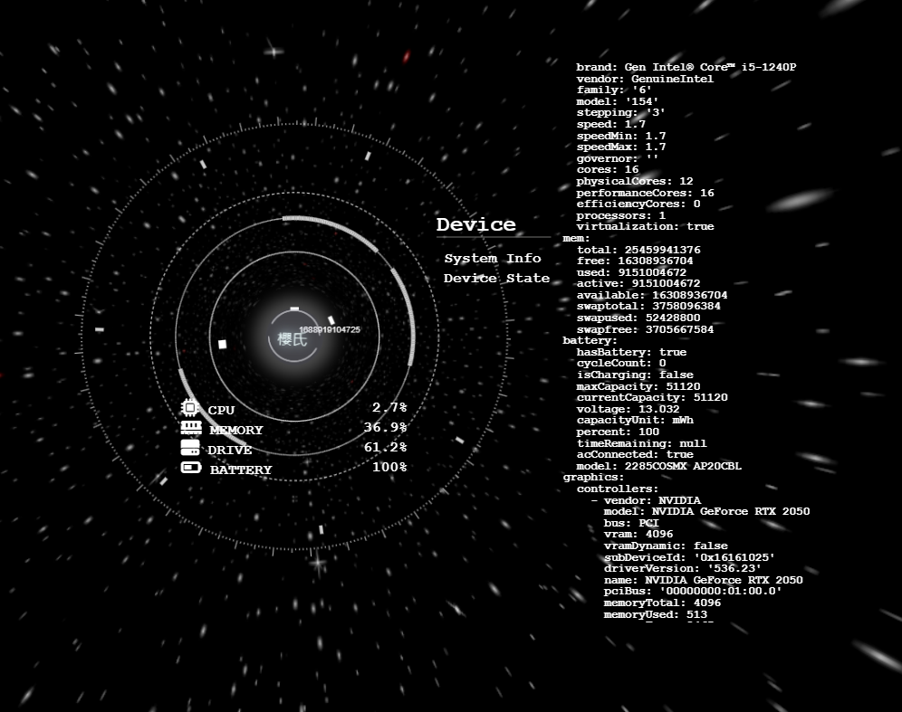
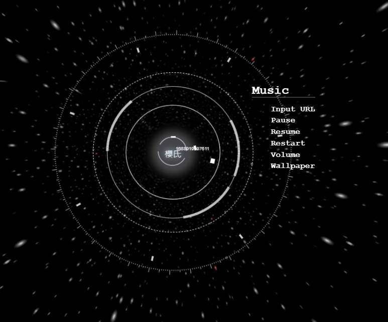
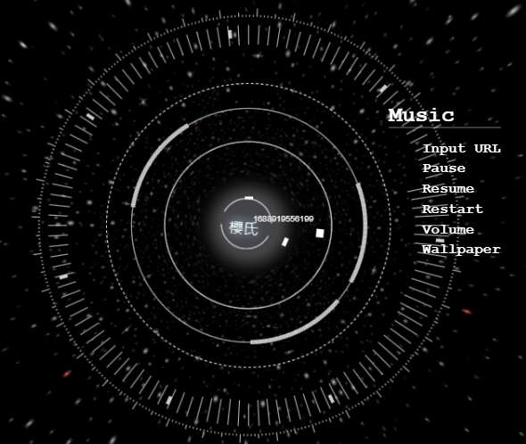
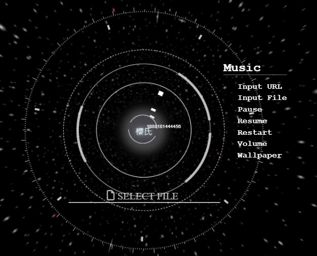
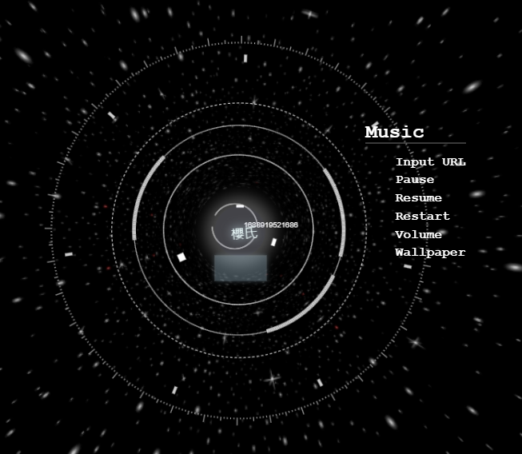
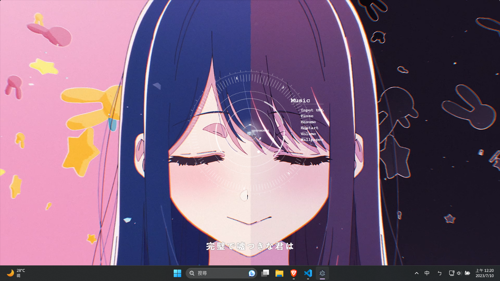
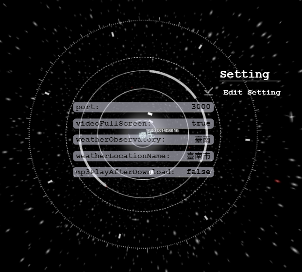

# Assistant
使用electron.js打造的桌面助理 

## 開發中功能

- 大語言模型人工智慧助理 (開發中) 
    使用rwkv模型來驅動，目前正在整合TTS功能 
    因為整個services架構還不穩定(隨時可能更動) 
    所以暫時不開源 
   

- 背景同步 (已初步完成) 
    採用[electron-as-wallpaper]()模組，創造一層桌布窗口 
    窗口平時是three.js的無盡星空背景 
    透過選單內的Wallpaper能切換顯示目前Music內的資源(例如影片、圖片、GIF...等)

## 項目結構
- `./services` (開發中，極其不穩定，暫時不上傳) 
    - RWKV - 大型語言模型，使用[rwkv.cpp](https://github.com/saharNooby/rwkv.cpp)進行推理 
        具有將預先讀好的prompt token logits state資料暫存的緩存機制
    - TTS - 文本轉語音服務，使用[edge-tts](https://github.com/rany2/edge-tts)模組

在`./utils`中可以看見相應的js class去進行對接

## 選單
 

### explore
 
- Get Weather 
    使用中央氣象局的api取的目前的天氣預報
     
 
### device
 
- System Info 
    使用[systeminformation](https://github.com/sebhildebrandt/systeminformation)獲取系統訊息，並分批上傳前端，顯示在獨立畫面
- Device State 
    使用[systeminformation](https://github.com/sebhildebrandt/systeminformation)獲取狀態，每5秒更新一次

### music
 
- Input URL  
    播放輸入的youtube影片(目前不支援歌單) 
    在後端使用[ytdl](https://github.com/fent/node-ytdl-core)取得mp3影片，並且及時串流回前端(使用[express](https://github.com/ expressjs/express)、[ffmepg](https://ffmpeg.org/))，並控制canvas渲染頻率圖
     
     
- Input File  
    播放輸入的檔案，支援大多影片、圖片、音檔的格式，且支援GIF 
     
- Pause
- Resume
- Restart
- Volume 
    觸發之後，畫面中心會出現音量調，使用滾輪來控制音量加減，步進單位為5%，最高100%
     
- Wallpaper 
    切換背景，預設為星空
     
### setting
- Edit 
    更改部分設定
     
## 已知問題
有時會在隨機時間後結束播放 
https://stackoverflow.com/questions/67888365/error-output-stream-closed-when-trying-to-stream-to-express-server-using-ffmpeg