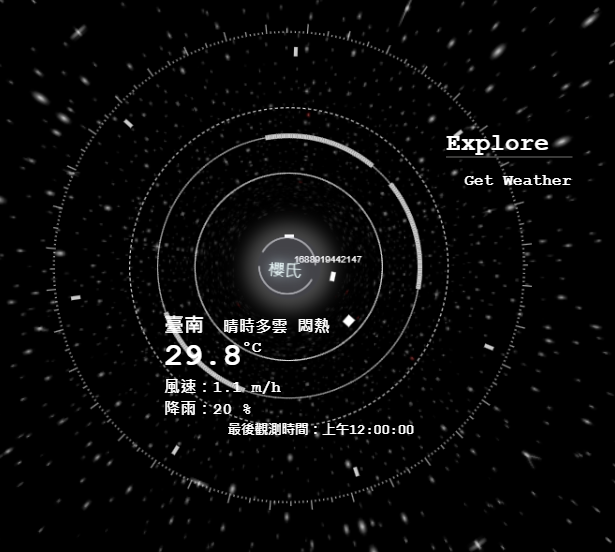
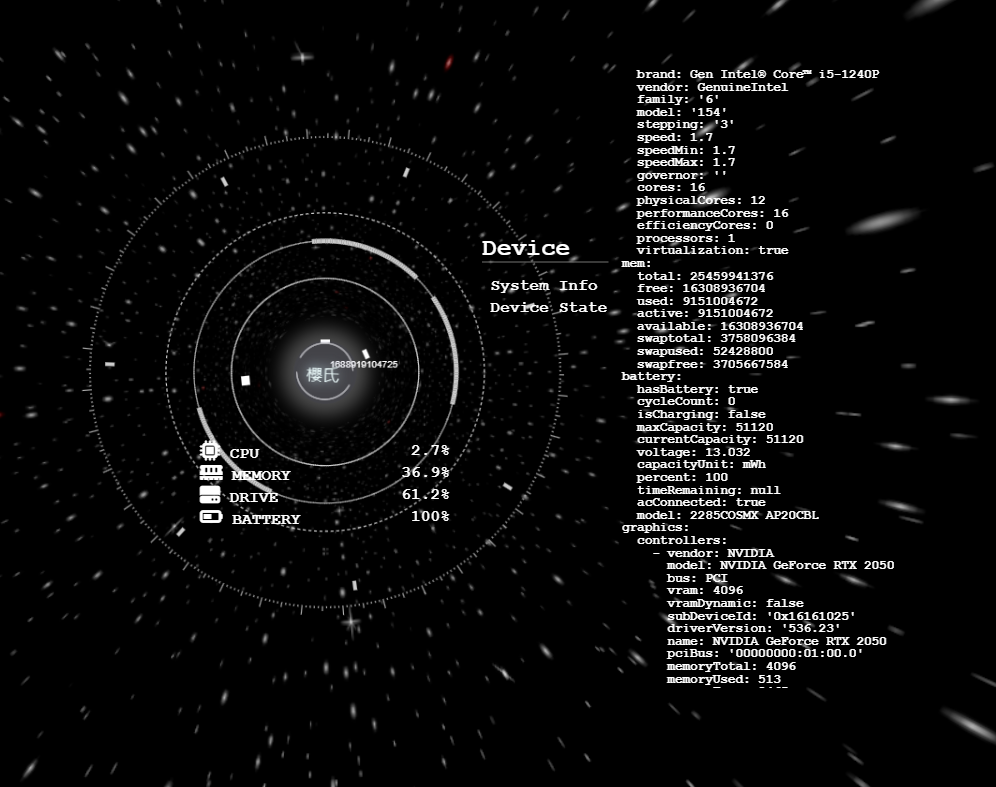
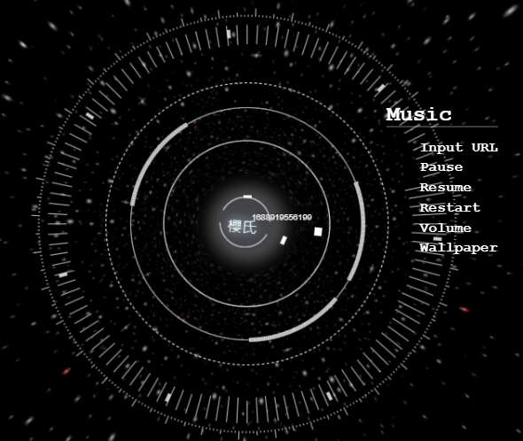
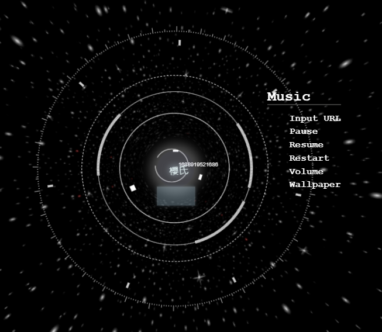
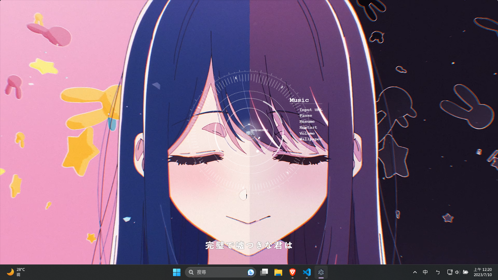

# Assistant
使用electron.js打造的桌面助理 

## 選單
 

### explore
 
- Get Weather 
    使用中央氣象局的api取的目前的天氣預報
     
 
### device
 
- System Info 
    使用[systeminformation](https://github.com/sebhildebrandt/systeminformation)獲取系統訊息，並分批上傳前端，顯示在獨立畫面
- Device State 
    使用[systeminformation](https://github.com/sebhildebrandt/systeminformation)獲取狀態，每5秒更新一次

### music
 
- Input URL  
    播放輸入的youtube影片(目前不支援歌單) 
    在後端使用[ytdl](https://github.com/fent/node-ytdl-core)取得mp3影片，並且及時串流回前端(使用[express](https://github.com/ expressjs/express)、[ffmepg](https://ffmpeg.org/))，並控制canvas渲染頻率圖
     
     
- Pause
- Resume
- Restart
- Volume 
    觸發之後，畫面中心會出現音量調，使用滾輪來控制音量加減，步進單位為5%，最高100%
     
- Wallpaper 
    切換背景，預設為星空
     
  
## 已知問題
有時會在隨機時間後結束播放 
https://stackoverflow.com/questions/67888365/error-output-stream-closed-when-trying-to-stream-to-express-server-using-ffmpeg